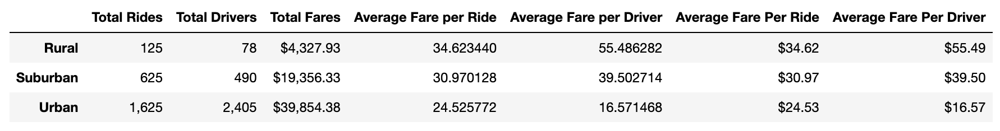
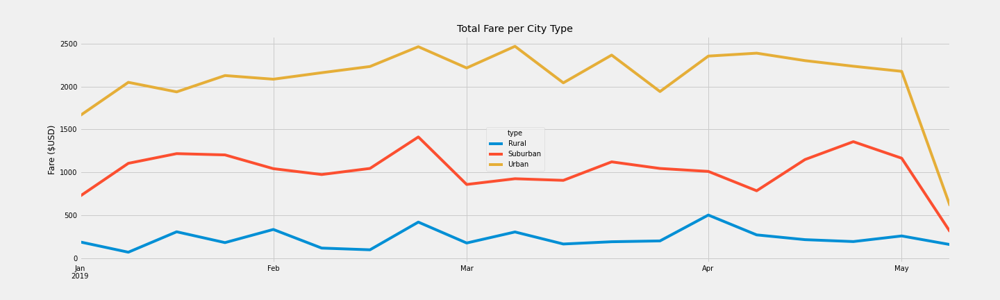

# PyBer_Analysis
## Project Overview
The project requires the analysis of all the rideshare data from January to early May of 2019 in order to create a compelling visualization for the CEO, V. Isualize. The purpose of the project is to understand how the ride-sharing information by city differs, and how that information can be used by V. Isualize and the rest of the Pyber team to make analysis based decisions by looking at city type to compete effectively in the ride sharing market. The analysis will be used to supply three business recommendations to the CEO for addressing any disparities among the city types.

### Resources:
- Data Source: city_data.csv
- Data Source: ride_data.csv
- Sofware: Jupyter Notebook
- Library: Matplotlib.pyplot
- Library: Pandas
- Library: Matplotlib (imported style)
- Language: Python 3.6.7

## Results
### Pyber Summary DataFrame:

Based on the PyBer Summary DataFrame above, heavily populated cities have more drivers and a higher ride count. The Urban cities have 1,500 more rides than the Rural cities and 2,327 more drivers. As a result, there is a higher count of fares in areas where there is a more dense population and the average fare per ride decreases by $10 from a Rural area to an Urban area. The average fare per driver also decreases by around $40. The Suburban areas also conduct 1,000 less rides than Urban areas and have 1,915 less drivers.

### Total Fare per City Type:

## Summary
